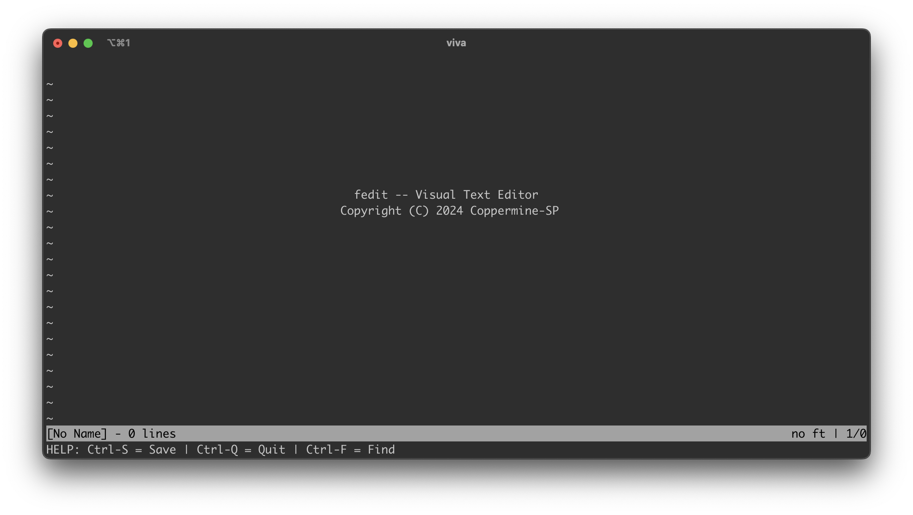

## fedit 프로젝트 설계서 (Technical documentation)

fedit는 TUI 기반의 다중 플랫폼 (Windows, Linux, macOS)를 지원하는 텍스트 에디터입니다.

**요구되는 구체적인 기능 명세는 다음과 같습니다:**
- Windows, macOS, Linux 환경에서 동작해야 한다.
- TUI 기반의 사용자 인터페이스를 가져야 한다.
- 기존의 파일을 수정하거나 새로운 파일을 생성할 수 있어야 한다.
- 최하단부에 메세지 바와 상태 바가 존재해야 한다.
- 텍스트를 수정 할 수 있어야 한다.
- 방향 키, Home, End, PgUp, PgDn키로 커서 이동이 가능해야 한다.
- 텍스트 검색이 가능해야 한다.

프로젝트가 확장 및 유지 보수 가능한 구조를 가지기 위해 터미널로 사용자와 상호 작용하는 부분과 버퍼에 텍스트를 저장하고 다루는 부분을 모듈화하고, 이를 기반으로 텍스트 에디터를 구현합니다.

## Table of Content
- [I. 개요 (Overview)](overview.md)
  
- [II. termui, native_termui 모듈]()
    - A. 모듈 개요
    - B. 사용자 인터페이스 구축
    - C. 사용자 입력 핸들링
    - D. 프롬프트
    - E. 동적 화면 리사이징
    
- [III. textengine 모듈]()
    - A. 모듈 개요
    - B. 내부 자료 구조
    - C. 문자 삽입과 삭제
    
- [IV. 기능 구현]()
    - A. 기능 개요
    - B. 커서 표시와 위치 체계
    - C. 커서 이동
    - D. 텍스트 수정
    - E. 탐색
    - F. 저장
    - G. 종료
